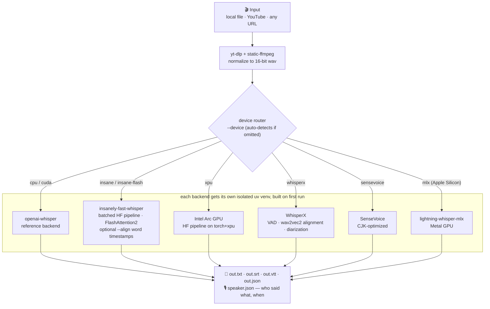

# Reverse Engineering Evidence — Audio / Voice Stack

Universal-build forensic snapshot from the supplied repositories.

## stemdeck
- **EXISTS:** repository and README are accessible.
### Evidence excerpt

<div align="center">


**Free, local stem separation. No account. No upload. No subscription.**

<div align="center">
  <a href="https://github.com/stemdeckapp/stemdeck/actions/workflows/ci.yml"></a>
  <a href="https://github.com/stemdeckapp/stemdeck/stargazers"></a>
  <a href="https://github.com/stemdeckapp/stemdeck/releases"></a>
  <a href="https://github.com/stemdeckapp/stemdeck/releases/latest"></a>
  <a href="https://github.com/stemdeckapp/stemdeck/blob/main/LICENSE"></a>
</div>

<br>

<p align="center"><sub>JOIN THE COMMUNITY</sub></p>
<div align="center">
  <a href="https://github.com/stemdeckapp/stemdeck"></a>
  <a href="https://discord.gg/YhCKsjhcwB"></a>
  <a href="https://www.reddit.com/r/StemDeckApp/"></a>
  <a href="https://www.instagram.com/stemdeck"></a>
  <a href="https://x.com/StemDeckApp"></a>
  <a href="https://stemdeck.app"></a>
</div>

</div>

<br>

Drop in an MP3, WAV, FLAC, OGG/Opus, MP4, or M4A file, or paste a YouTube URL, and StemDeck splits the audio into up to six stems (vocals, drums, bass, guitar, piano, other). Play them back in a DAW-style multitrack mixer: mute, solo, balance levels, zoom the waveform, loop a region, and export individual stems or a custom mix. Everything runs locally on your own machine.

> **What is this?** StemDeck is a stem separation tool, not a downloader. Its main job is processing audio you already own: drag an MP3, WAV, FLAC, OGG, or M4A onto the import bar and go. YouTube support is a convenience for content you have the right to process. StemDeck does not store, cache, or redistribute any downloaded content. Everything happens locally and nothing leaves your machine.

> StemDeck is a free, open alternative to cloud stem-splitters like Moises and LALAL.AI: no account, no quota, no uploads, no subscription. If you want stems for personal study and prefer to keep things local and free, StemDeck has you covered. If you need the polish, a mobile app, or deeper musician tooling, the commercial products are a better fit.


## Star History

<a href="https://www.star-history.com/?repos=stemdeckapp%2Fstemdeck&type=date&legend=top-left">
 <picture>
   <source media="(prefers-color-scheme: dark)" srcset="https://api.star-history.com/chart?repos=stemdeckapp/stemdeck&type=date&theme=dark&legend=top-left&sealed_token=ZCLzbiDb9k7qGcBlGZ4Y7ztZz0mepkiAVraLOc4qeVQjSM_MfPIQD7P9n2wvwBM8mw8EKfkSAQfM2vByzi3mEPklzgSWtYnVzZsfexzb7LxwoATlrgSmWesQiwczpg4xa32nF4_Np1Qpe62s5eFsl0o46JzPuwwd5M6pwShbj1PfDMFD4b0Yuu0jH3rD" />
   <source media="(prefers-color-scheme: light)" srcset="https://api.star-history.com/chart?repos=stemdeckapp/stemdeck&type=date&legend=top-left&sealed_token=ZCLzbiDb9k7qGcBlGZ4Y7ztZz0mepkiAVraLOc4qeVQjSM_MfPIQD7P9n2wvwBM8mw8EKfkSAQfM2vByzi3mEPklzgSWtYnVzZsfexzb7LxwoATlrgSmWesQiwczpg4xa32nF4_Np1Qpe62s5eFsl0o46JzPuwwd5M6pwShbj1PfDMFD4b0Yuu0jH3rD" />

## fish-speech
- **EXISTS:** repository and README are accessible.
### Evidence excerpt

<div align="center">
<h1>Fish Speech</h1>

**English** | [简体中文](docs/README.zh.md) | [Portuguese](docs/README.pt-BR.md) | [日本語](docs/README.ja.md) | [한국어](docs/README.ko.md) | [العربية](docs/README.ar.md) | [Español](docs/README.es.md)  <br>

<a href="https://www.producthunt.com/products/fish-speech?embed=true&utm_source=badge-top-post-badge&utm_medium=badge&utm_source=badge-fish&#0045;audio&#0045;s1" target="_blank"></a>
<a href="https://trendshift.io/repositories/7014" target="_blank">
    
</a>
<br>
</div>
<br>

<div align="center">
    <br>
</div>

<br>

<div align="center">
    <a target="_blank" href="https://discord.gg/Es5qTB9BcN">
        
    </a>
    <a target="_blank" href="https://hub.docker.com/r/fishaudio/fish-speech">
        
    </a>
    <a target="_blank" href="https://pd.qq.com/s/bwxia254o">
      
    </a>
</div>

<div align="center">
    <a target="_blank" href="https://huggingface.co/fishaudio/s2-pro">
        
    </a>
    <a target="_blank" href="https://fish.audio/blog/fish-audio-open-sources-s2/">
        
    </a>
    <a target="_blank" href="https://arxiv.org/abs/2603.08823">
        
    </a>
</div>

> [!IMPORTANT]
> **License Notice**  

## F5-TTS
- **EXISTS:** repository and README are accessible.
### Evidence excerpt

# F5-TTS: A Fairytaler that Fakes Fluent and Faithful Speech with Flow Matching

[](https://github.com/SWivid/F5-TTS)
[](https://arxiv.org/abs/2410.06885)
[](https://swivid.github.io/F5-TTS/)
[](https://huggingface.co/spaces/mrfakename/E2-F5-TTS)
[](https://modelscope.cn/studios/AI-ModelScope/E2-F5-TTS)
[](https://x-lance.sjtu.edu.cn/)
[](https://www.sii.edu.cn/)
[](https://www.pcl.ac.cn)
<!--  -->

**F5-TTS**: Diffusion Transformer with ConvNeXt V2, faster trained and inference.

**E2 TTS**: Flat-UNet Transformer, closest reproduction from [paper](https://arxiv.org/abs/2406.18009).

**Sway Sampling**: Inference-time flow step sampling strategy, greatly improves performance

### Thanks to all the contributors !

## News
- **2025/03/12**: 🔥 F5-TTS v1 base model with better training and inference performance. [Few demo](https://swivid.github.io/F5-TTS_updates).
- **2024/10/08**: F5-TTS & E2 TTS base models on [🤗 Hugging Face](https://huggingface.co/SWivid/F5-TTS), [🤖 Model Scope](https://www.modelscope.cn/models/SWivid/F5-TTS_Emilia-ZH-EN), [🟣 Wisemodel](https://wisemodel.cn/models/SJTU_X-LANCE/F5-TTS_Emilia-ZH-EN).

## Installation

### Create a separate environment if needed

```bash
# Create a conda env with python_version>=3.10  (you could also use virtualenv)
conda create -n f5-tts python=3.11
conda activate f5-tts

# Install FFmpeg if you haven't yet
conda install ffmpeg
```

### Install PyTorch with matched device

<details>
<summary>NVIDIA GPU</summary>

> ```bash
> # Install pytorch with your CUDA version, e.g.
> pip install torch==2.8.0+cu128 torchaudio==2.8.0+cu128 --extra-index-url https://download.pytorch.org/whl/cu128

## GPT-SoVITS
- **EXISTS:** repository and README are accessible.
### Evidence excerpt

<div align="center">

<h1>GPT-SoVITS-WebUI</h1>
A Powerful Few-shot Voice Conversion and Text-to-Speech WebUI.<br><br>

[](https://github.com/RVC-Boss/GPT-SoVITS)

<a href="https://trendshift.io/repositories/7033" target="_blank"></a>

<!-- img src="https://counter.seku.su/cmoe?name=gptsovits&theme=r34" /><br> -->

[](https://www.python.org)
[](https://github.com/RVC-Boss/gpt-sovits/releases)

[](https://colab.research.google.com/github/RVC-Boss/GPT-SoVITS/blob/main/Colab-WebUI.ipynb)
[](https://lj1995-gpt-sovits-proplus.hf.space/)
[](https://hub.docker.com/r/xxxxrt666/gpt-sovits)

[](https://www.yuque.com/baicaigongchang1145haoyuangong/ib3g1e)
[](https://rentry.co/GPT-SoVITS-guide#/)
[](https://github.com/RVC-Boss/GPT-SoVITS/blob/main/docs/en/Changelog_EN.md)
[](https://github.com/RVC-Boss/GPT-SoVITS/blob/main/LICENSE)

**English** | [**中文简体**](./docs/cn/README.md) | [**日本語**](./docs/ja/README.md) | [**한국어**](./docs/ko/README.md) | [**Türkçe**](./docs/tr/README.md)

</div>

---

## Features:

1. **Zero-shot TTS:** Input a 5-second vocal sample and experience instant text-to-speech conversion.

2. **Few-shot TTS:** Fine-tune the model with just 1 minute of training data for improved voice similarity and realism.

3. **Cross-lingual Support:** Inference in languages different from the training dataset, currently supporting English, Japanese, Korean, Cantonese and Chinese.

4. **WebUI Tools:** Integrated tools include voice accompaniment separation, automatic training set segmentation, multilingual ASR with [Fun-ASR-Nano](https://github.com/FunAudioLLM/Fun-ASR), [SenseVoice](https://github.com/FunAudioLLM/SenseVoice), and classic [FunASR](https://github.com/modelscope/FunASR), plus text labeling, assisting beginners in creating training datasets and GPT/SoVITS models.

**Check out our [demo video](https://www.bilibili.com/video/BV12g4y1m7Uw) here!**

Unseen speakers few-shot fine-tuning demo:

https://github.com/RVC-Boss/GPT-SoVITS/assets/129054828/05bee1fa-bdd8-4d85-9350-80c060ab47fb


## chatterbox
- **EXISTS:** repository and README are accessible.
### Evidence excerpt


# Chatterbox TTS

[](https://resemble-ai.github.io/chatterbox_demopage/)
[](https://huggingface.co/spaces/ResembleAI/Chatterbox-Multilingual-TTS)
[](https://podonos.com/resembleai/chatterbox)
[](https://discord.gg/rJq9cRJBJ6)

*Made with ♥️ by* <a href="https://resemble.ai" target="_blank"></a>

**Chatterbox** is a family of state-of-the-art, open-source text-to-speech models by Resemble AI.

## Latest Release: Chatterbox Multilingual V3

**Chatterbox Multilingual V3** is the latest general-purpose multilingual TTS model in the Chatterbox family. It keeps the same 0.5B model size while improving speaker similarity, reducing hallucinations, and producing more natural, conversational speech across languages.

V3 is designed for broad language coverage like V2, but with stronger stability and more expressive generation. It is the recommended multilingual model for users who want one voice cloning model that works across many languages.

Alongside V3, we are releasing the **Single Language Pack**: dedicated finetunes for priority languages where tighter quality control, stronger language-specific behavior, and more specialized speech generation are valuable.

- **Broad Multilingual Coverage:** Designed as the main general-purpose multilingual Chatterbox model, supporting wide language coverage similar to V2.
- **Single Language Pack:** Dedicated single-language models provide stronger specialization and quality control where language- and regional-dialect-specific performance matters most.
- **More Consistent Speaker Similarity:** Improves voice identity and accent preservation across languages, making cross-language voice cloning more stable and reliable.
- **Reduced Hallucination:** V3 is optimized to reduce unwanted continuation, repetition, and off-prompt speech, especially in cases where earlier multilingual models were less stable.

For low-latency English voice agents, **Chatterbox-Turbo** is our most efficient model. Built on a streamlined 350M parameter architecture, **Turbo** delivers high-quality speech with less compute and VRAM than our previous models. We have also distilled the speech-token-to-mel decoder, previously a bottleneck, reducing generation from 10 steps to just **one**, while retaining high-fidelity audio output.

**Paralinguistic tags** are now native to the Turbo model, allowing you to use `[cough]`, `[laugh]`, `[chuckle]`, and more to add distinct realism. While Turbo was built primarily for low-latency voice agents, it excels at narration and creative workflows.

For the most resource-constrained deployments, **Chatterbox-Nano** shares Turbo's architecture in an even smaller 110M parameter package. It targets on-device and CPU inference — running **3x faster than realtime on 8 CPU cores** — while keeping the same single-step decoder and native paralinguistic tag support. Nano is the recommended model when memory and latency budgets are tightest.

If you like the model but need to scale or tune it for higher accuracy, check out our competitively priced TTS service (<a href="https://resemble.ai">link</a>). It delivers reliable performance with ultra-low latency of sub 200ms—ideal for production use in agents, applications, or interactive media.


### ⚡ Model Zoo

Choose the right model for your application.

| Model                                                                                                           | Size | Languages | Key Features                                            | Best For                                     | 🤗                                                                  | Examples |
|:----------------------------------------------------------------------------------------------------------------| :--- | :--- |:--------------------------------------------------------|:---------------------------------------------|:--------------------------------------------------------------------------| :--- |
| **Chatterbox-Turbo**                                                                                            | **350M** | **English** | Paralinguistic Tags (`[laugh]`), Lower Compute and VRAM | Zero-shot voice agents,  Production          | [Demo](https://huggingface.co/spaces/ResembleAI/chatterbox-turbo-demo)        | [Listen](https://resemble-ai.github.io/chatterbox_turbo_demopage/) |
| **Chatterbox-Nano**                                                                                             | **110M** | **English** | Same architecture as Turbo, Paralinguistic Tags, Runs on CPU (3x realtime on 8 cores) | On-device / CPU inference, tight latency & memory budgets | [Model](https://huggingface.co/ResembleAI/chatterbox-nano)        | — |

## transcribe-anything
- **EXISTS:** repository and README are accessible.
### Evidence excerpt

# transcribe-anything

[](https://github.com/zackees/transcribe-anything/actions/workflows/test_macos.yml)
[](https://github.com/zackees/transcribe-anything/actions/workflows/test_win.yml)
[](https://github.com/zackees/transcribe-anything/actions/workflows/test_ubuntu.yml)
[](https://github.com/zackees/transcribe-anything/actions/workflows/test_whisperx.yml)
[](https://github.com/zackees/transcribe-anything/actions/workflows/lint.yml)


### Every Whisper variant under one app w/ FULL OPTIMIZATIONS! Easiest install ever! Mac/Linux/Win

Over 1200+⭐'s because this program just works! Works great for windows and mac. This whisper front-end app is the only one to generate a `speaker.json` file which partitions the conversation by who doing the speaking.

## How it works

One CLI, one router: `--device` picks the backend (auto-detected if omitted), and every backend runs in its **own isolated environment** built on first use — no CUDA/torch dependency hell in your python.



[](https://star-history.com/#zackees/transcribe-anything&Date)


## Voice-Recorder
- **EXISTS:** repository and README are accessible.
### Evidence excerpt

# Fossify Voice Recorder


<a href="https://play.google.com/store/apps/details?id=org.fossify.voicerecorder"></a> <a href="https://f-droid.org/packages/org.fossify.voicerecorder/"></a> <a href="https://apt.izzysoft.de/fdroid/index/apk/org.fossify.voicerecorder"></a>

Introducing Fossify Voice Recorder – where capturing crystal-clear audio and preserving precious moments is effortless and enjoyable. Seamlessly blend
simplicity with functionality as you embark on a journey of seamless recording experiences tailored to your needs.

**🔊 HIGH-QUALITY AUDIO CAPTURE:**  
Remember every word, every note, and every emotion with pristine audio quality. Fossify Voice Recorder empowers you to capture high-fidelity recordings
effortlessly, ensuring that every detail is preserved with clarity and precision.

**🎙️ VERSATILE RECORDING OPTIONS:**  
From voice memos to musical inspirations, this intuitive app transforms your device into a versatile recording studio. Explore the freedom to document your
surroundings and unleash your creativity with ease.

**🚀 NO-FUSS FUNCTIONALITY:**  
Enjoy a clutter-free experience with Fossify Voice Recorder. Say goodbye to unnecessary features and hello to a streamlined interface designed for intuitive
navigation and seamless recording.

**📊 INTUITIVE VISUALIZATION:**  
Immerse yourself in the recording process with real-time sound volume visualization. Experience the thrill of monitoring your recordings with a sleek,
interactive display that enhances your recording experience.

**🔒 PRIVACY-FIRST APPROACH:**  
Rest easy knowing that your privacy is our priority. Fossify Voice Recorder operates offline, ensuring maximum privacy, security, and stability without the need
for internet access. Your recordings remain confidential and under your control at all times.

**🎨 CUSTOMIZABLE INTERFACE:**  
Personalize your recording experience with customizable colors and themes. Embrace the sleek elegance of material design and dark theme options, offering a
visually stunning experience tailored to your preferences.

**🤝 USER-FRIENDLY FEATURES:**  
Discover intuitive functionalities like customizable filename formats and practical widgets for quick recordings. With Fossify Voice Recorder, the power to
record is in your hands.

**🌐 AD-FREE & OPEN-SOURCE:**  
Say goodbye to intrusive ads and unnecessary permissions. Fossify Voice Recorder is ad-free, fully open-source, and grants you the freedom to use the app as you
please, without compromise.

Capture moments, preserve memories, and unleash your creativity with Fossify Voice Recorder. Download now and experience recording like never before.

➡️ Explore more Fossify apps: https://www.fossify.org<br>
➡️ Open-Source Code: https://www.github.com/FossifyOrg<br>

## WiFiAudioStreaming-Desktop
- **EXISTS:** repository and README are accessible.
### Evidence excerpt

<p align="center">
  
</p>

<h1 align="center">WiFi Audio Streaming (Desktop)</h1>

<p align="center">
  <a href="https://github.com/marcomorosi06/WiFiAudioStreaming-Desktop/releases"></a>
  <a href="https://gitlab.com/marcomorosi.dev/WiFiAudioStreaming-Desktop/-/releases"></a>
  <a href="https://aur.archlinux.org/packages/wifi-audio-streaming-desktop"></a>
</p>

<p align="center">
<a href="https://trendshift.io/repositories/16237?utm_source=trendshift-badge&amp;utm_medium=badge&amp;utm_campaign=badge-trendshift-16237" target="_blank" rel="noopener noreferrer"></a>
</p>

Turn your computer into a **wireless audio transmitter or receiver**.

This application allows you to send your PC's audio to any device on the same local network, or listen to audio from another device. It is designed to work seamlessly with the [Android version](https://github.com/marcomorosi06/WiFiAudioStreaming-Android).

🌐 **Website**: [marcomorosi.eu/wifi-audio-streaming](https://www.marcomorosi.eu/wifi-audio-streaming/)

[](https://ko-fi.com/marcomorosi)

---

# 📸 Overview

*Screenshots of the Material You interface. Preview of the upcoming Material You interface (v1.2). Current stable release (v1.1) uses the previous UI.*

<p align="center">
  <br>
  <i>Server Mode</i>
</p>

<p align="center">
  <br>
  <i>Client Mode</i>
</p>

<p align="center">
  <br>
  <i>Streaming</i>
</p>


## Integration rule
These repositories are treated as capability sources/adapters. Production integration must pass license, provenance, runtime, and consent gates; reverse-engineering tools are not production dependencies.